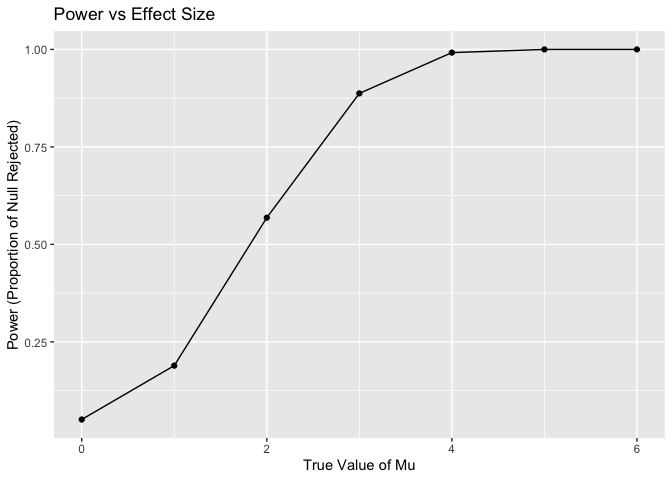

p8105_hw5_tq2171
================
Tingyu Qian
2024-11-13

## Problem 1

``` r
# Load necessary libraries
library(ggplot2)

# Function to check if there are duplicate birthdays in a group
has_duplicate_birthday <- function(group_size) {
  birthdays <- sample(1:365, group_size, replace = TRUE)  # Random birthdays
  return(any(duplicated(birthdays)))                      # Check for duplicates
}

# Simulation for each group size from 2 to 50
set.seed(123)  # For reproducibility
group_sizes <- 2:50
num_simulations <- 10000
results <- data.frame(group_size = integer(), probability = numeric())

for (n in group_sizes) {
  # Run the function 10,000 times and calculate the probability of a duplicate
  shared_birthday_count <- sum(replicate(num_simulations, has_duplicate_birthday(n)))
  probability <- shared_birthday_count / num_simulations
  
  # Store results
  results <- rbind(results, data.frame(group_size = n, probability = probability))
}

# Plotting the results
ggplot(results, aes(x = group_size, y = probability)) +
  geom_line() +
  geom_point() +
  labs(
    title = "Probability of at Least Two People Sharing a Birthday",
    x = "Group Size",
    y = "Probability"
  ) +
  theme_minimal()
```

<!-- -->

Initially, the probability is very low for small group sizes, as
expected, since fewer people mean fewer chances for overlap in
birthdays. However, the probability grows rapidly as the group size
increases. By the time the group reaches about 23 people, the
probability surpasses 50%, meaning there’s a greater than even chance
that at least two people share a birthday. This counterintuitive result
demonstrates the birthday paradox: even in relatively small groups, the
probability of shared birthdays is surprisingly high. By a group size of
50, the probability is nearly 1, indicating an almost certain chance of
a shared birthday.

## Problem 2

``` r
# load labraries and set seeds
library(tidyverse)
```

    ## ── Attaching core tidyverse packages ──────────────────────── tidyverse 2.0.0 ──
    ## ✔ dplyr     1.1.4     ✔ readr     2.1.5
    ## ✔ forcats   1.0.0     ✔ stringr   1.5.1
    ## ✔ lubridate 1.9.3     ✔ tibble    3.2.1
    ## ✔ purrr     1.0.2     ✔ tidyr     1.3.1
    ## ── Conflicts ────────────────────────────────────────── tidyverse_conflicts() ──
    ## ✖ dplyr::filter() masks stats::filter()
    ## ✖ dplyr::lag()    masks stats::lag()
    ## ℹ Use the conflicted package (<http://conflicted.r-lib.org/>) to force all conflicts to become errors

``` r
set.seed(1)
library(broom)
library(ggplot2)
library(knitr)
```

``` r
# Set parameters
n <- 30     # sample size
sigma <- 5  # standard deviation
mu_values <- 0:6  # values of mu to test
alpha <- 0.05     # significance level
num_simulations <- 5000  # number of simulations per mu
```

``` r
# Initialize storage for results
results <- data.frame(mu = numeric(), estimate = numeric(), p_value = numeric(), reject_null = logical())
```

``` r
# Function to simulate data, perform t-test, and store results
run_simulation <- function(mu) {
  estimates <- numeric(num_simulations)
  p_values <- numeric(num_simulations)
  reject_null <- logical(num_simulations)
  
  for (i in 1:num_simulations) {
    # Generate sample data
    data <- rnorm(n, mean = mu, sd = sigma)
    
    # Perform t-test
    test <- t.test(data, mu = 0)
    tidy_test <- tidy(test)
    
    # Store results
    estimates[i] <- tidy_test$estimate
    p_values[i] <- tidy_test$p.value
    reject_null[i] <- tidy_test$p.value < alpha
  }
  
  data.frame(mu = mu, estimate = estimates, p_value = p_values, reject_null = reject_null)
}
```

``` r
# Run simulations for each value of mu
for (mu in mu_values) {
  results <- rbind(results, run_simulation(mu))
}

# Calculate power and average estimate for each mu
power_analysis <- results %>%
  group_by(mu) %>%
  summarise(
    power = mean(reject_null),
    avg_estimate_all = mean(estimate),
    avg_estimate_rejected = mean(estimate[reject_null])
  )
```

``` r
# Plot 1: Power vs. Effect Size (mu)
ggplot(power_analysis, aes(x = mu, y = power)) +
  geom_line() +
  geom_point() +
  labs(title = "Power vs Effect Size", x = "True Value of Mu", y = "Power (Proportion of Null Rejected)")
```

<!-- --> The
plot shows a clear positive association between effect size (μ) and the
power of the test (the probability of rejecting the null hypothesis when
it is false). As the true value of μ increases, the power also
increases, reaching nearly 100% when μ is around 4 or higher.

This trend indicates that larger effect sizes make it easier for the
test to detect a difference from the null hypothesis (μ=0), thus
increasing the likelihood of rejecting the null hypothesis correctly.
When the effect size is small (close to 0), the power is low, meaning
there is a higher chance of failing to detect the true effect. As the
effect size grows, the test becomes more sensitive, and the power
approaches 1.

``` r
# Plot 2 average estimate of mu across all samples and only those where the null was rejected
ggplot(power_analysis, aes(x = mu)) +
  geom_line(aes(y = avg_estimate_all, color = "All Samples")) +
  geom_point(aes(y = avg_estimate_all, color = "All Samples")) +
  geom_line(aes(y = avg_estimate_rejected, color = "Null Rejected Only")) +
  geom_point(aes(y = avg_estimate_rejected, color = "Null Rejected Only")) +
  labs(
    title = "Average Estimate of Mu vs True Value of Mu",
    x = "True Value of Mu",
    y = "Average Estimate of Mu"
  ) +
  scale_color_manual(name = "Samples", values = c("All Samples" = "blue", "Null Rejected Only" = "red")) +
  theme_minimal()
```

<!-- -->

In the plot, the sample average of $\hat{\mu}$ across tests for which
the null hypothesis was rejected (shown in red) tends to be higher than
the true value of $\mu$, especially at lower values of $\mu$. This
discrepancy occurs due to selection bias: by only considering samples
where the null hypothesis was rejected, we are effectively selecting
cases with larger deviations from the null.

When $\mu$ is small (close to zero), the test requires larger sample
means to reject the null hypothesis, leading to an overestimation of
$\mu$ in those cases. As $\mu$ increases, the bias decreases because the
true effect size is large enough that the sample mean is more likely to
reflect the true $\mu$. Therefore, the average estimate across tests
where the null is rejected is not consistently equal to the true $\mu$
due to this selection effect, particularly for smaller values of $\mu$.

## Problem 3

``` r
# Load the data
data <- read.csv("./data/homicide-data.csv")
```

There are 52179 observations in the dataset ‘homicide’, which means
there are 52179 rows and 12 variables in the dataset. These 12 variables
are uid, reported_date, victim_last, victim_first, victim_race,
victim_age, victim_sex, city, state, lat, lon, disposition. The
Washington Post collected data on more than 52,000 criminal homicides
over the past decade in 50 of the largest American cities. The uid
variable is a unique identifier assigned to each case. Reported_date
records the date the homicide was reported, formatted as YYYYMMDD. The
victim_last and victim_first variables capture the victim’s last and
first names, respectively, providing basic identifying information. The
victim_race variable indicates the race of the victim, which could be
used to explore demographic patterns in homicide cases. Similarly,
victim_age records the age of the victim, and victim_sex indicates the
victim’s gender, allowing for demographic analysis by age and sex. The
city and state variables identify the location of each homicide by
specifying the city and state where it occurred, while lat (latitude)
and lon (longitude) provide more precise geographical coordinates.
Finally, the disposition variable indicates the outcome of each case,
specifying whether it was “Closed without arrest,” “Open/No arrest,” or
“Closed by arrest.”

``` r
# Create city_state variable
data <- data %>%
  mutate(city_state = paste(city, state, sep = ", "))
```

``` r
# Summarize total homicides and unsolved homicides (assume disposition column indicates solved/unsolved)
city_summary <- data %>%
  group_by(city_state) %>%
  summarise(
    total_homicides = n(),
    unsolved_homicides = sum(disposition %in% c("Closed without arrest", "Open/No arrest"))
  )

kable(city_summary)
```

| city_state         | total_homicides | unsolved_homicides |
|:-------------------|----------------:|-------------------:|
| Albuquerque, NM    |             378 |                146 |
| Atlanta, GA        |             973 |                373 |
| Baltimore, MD      |            2827 |               1825 |
| Baton Rouge, LA    |             424 |                196 |
| Birmingham, AL     |             800 |                347 |
| Boston, MA         |             614 |                310 |
| Buffalo, NY        |             521 |                319 |
| Charlotte, NC      |             687 |                206 |
| Chicago, IL        |            5535 |               4073 |
| Cincinnati, OH     |             694 |                309 |
| Columbus, OH       |            1084 |                575 |
| Dallas, TX         |            1567 |                754 |
| Denver, CO         |             312 |                169 |
| Detroit, MI        |            2519 |               1482 |
| Durham, NC         |             276 |                101 |
| Fort Worth, TX     |             549 |                255 |
| Fresno, CA         |             487 |                169 |
| Houston, TX        |            2942 |               1493 |
| Indianapolis, IN   |            1322 |                594 |
| Jacksonville, FL   |            1168 |                597 |
| Kansas City, MO    |            1190 |                486 |
| Las Vegas, NV      |            1381 |                572 |
| Long Beach, CA     |             378 |                156 |
| Los Angeles, CA    |            2257 |               1106 |
| Louisville, KY     |             576 |                261 |
| Memphis, TN        |            1514 |                483 |
| Miami, FL          |             744 |                450 |
| Milwaukee, wI      |            1115 |                403 |
| Minneapolis, MN    |             366 |                187 |
| Nashville, TN      |             767 |                278 |
| New Orleans, LA    |            1434 |                930 |
| New York, NY       |             627 |                243 |
| Oakland, CA        |             947 |                508 |
| Oklahoma City, OK  |             672 |                326 |
| Omaha, NE          |             409 |                169 |
| Philadelphia, PA   |            3037 |               1360 |
| Phoenix, AZ        |             914 |                504 |
| Pittsburgh, PA     |             631 |                337 |
| Richmond, VA       |             429 |                113 |
| Sacramento, CA     |             376 |                139 |
| San Antonio, TX    |             833 |                357 |
| San Bernardino, CA |             275 |                170 |
| San Diego, CA      |             461 |                175 |
| San Francisco, CA  |             663 |                336 |
| Savannah, GA       |             246 |                115 |
| St. Louis, MO      |            1677 |                905 |
| Stockton, CA       |             444 |                266 |
| Tampa, FL          |             208 |                 95 |
| Tulsa, AL          |               1 |                  0 |
| Tulsa, OK          |             583 |                193 |
| Washington, DC     |            1345 |                589 |

``` r
# Filter data for Baltimore, MD
baltimore_data <- data %>%
  filter(city == "Baltimore" & state == "MD")

# Summarize total and unsolved homicides in Baltimore
baltimore_summary <- baltimore_data %>%
  summarise(
    total_homicides = n(),
    unsolved_homicides = sum(disposition %in% c("Closed without arrest", "Open/No arrest"))
  )

# Perform proportion test
baltimore_prop_test <- prop.test(
  baltimore_summary$unsolved_homicides,
  baltimore_summary$total_homicides
)

# Use broom::tidy to convert the test output to a tidy dataframe
baltimore_results <- tidy(baltimore_prop_test)

# Extract the estimated proportion and confidence intervals
baltimore_estimate <- baltimore_results %>%
  select(estimate, conf.low, conf.high)

# Display the results
kable(baltimore_estimate)
```

|  estimate |  conf.low | conf.high |
|----------:|----------:|----------:|
| 0.6455607 | 0.6275625 | 0.6631599 |

``` r
# Function to perform prop.test and return a tidy dataframe
run_prop_test <- function(total, unsolved) {
  test_result <- prop.test(unsolved, total)
  tidy(test_result)
}

# Apply prop.test to each city and extract estimates and confidence intervals
results <- city_summary %>%
  mutate(
    test_result = map2(total_homicides, unsolved_homicides, run_prop_test)
  ) %>%
  unnest(test_result) %>%
  select(city_state, estimate, conf.low, conf.high)
```

    ## Warning: There was 1 warning in `mutate()`.
    ## ℹ In argument: `test_result = map2(total_homicides, unsolved_homicides,
    ##   run_prop_test)`.
    ## Caused by warning in `prop.test()`:
    ## ! Chi-squared approximation may be incorrect

``` r
# Display the final tidy dataframe with estimates and confidence intervals
kable(results)
```

| city_state         |  estimate |  conf.low | conf.high |
|:-------------------|----------:|----------:|----------:|
| Albuquerque, NM    | 0.3862434 | 0.3372604 | 0.4375766 |
| Atlanta, GA        | 0.3833505 | 0.3528119 | 0.4148219 |
| Baltimore, MD      | 0.6455607 | 0.6275625 | 0.6631599 |
| Baton Rouge, LA    | 0.4622642 | 0.4141987 | 0.5110240 |
| Birmingham, AL     | 0.4337500 | 0.3991889 | 0.4689557 |
| Boston, MA         | 0.5048860 | 0.4646219 | 0.5450881 |
| Buffalo, NY        | 0.6122841 | 0.5687990 | 0.6540879 |
| Charlotte, NC      | 0.2998544 | 0.2660820 | 0.3358999 |
| Chicago, IL        | 0.7358627 | 0.7239959 | 0.7473998 |
| Cincinnati, OH     | 0.4452450 | 0.4079606 | 0.4831439 |
| Columbus, OH       | 0.5304428 | 0.5002167 | 0.5604506 |
| Dallas, TX         | 0.4811742 | 0.4561942 | 0.5062475 |
| Denver, CO         | 0.5416667 | 0.4846098 | 0.5976807 |
| Detroit, MI        | 0.5883287 | 0.5687903 | 0.6075953 |
| Durham, NC         | 0.3659420 | 0.3095874 | 0.4260936 |
| Fort Worth, TX     | 0.4644809 | 0.4222542 | 0.5072119 |
| Fresno, CA         | 0.3470226 | 0.3051013 | 0.3913963 |
| Houston, TX        | 0.5074779 | 0.4892447 | 0.5256914 |
| Indianapolis, IN   | 0.4493192 | 0.4223156 | 0.4766207 |
| Jacksonville, FL   | 0.5111301 | 0.4820460 | 0.5401402 |
| Kansas City, MO    | 0.4084034 | 0.3803996 | 0.4370054 |
| Las Vegas, NV      | 0.4141926 | 0.3881284 | 0.4407395 |
| Long Beach, CA     | 0.4126984 | 0.3629026 | 0.4642973 |
| Los Angeles, CA    | 0.4900310 | 0.4692208 | 0.5108754 |
| Louisville, KY     | 0.4531250 | 0.4120609 | 0.4948235 |
| Memphis, TN        | 0.3190225 | 0.2957047 | 0.3432691 |
| Miami, FL          | 0.6048387 | 0.5685783 | 0.6400015 |
| Milwaukee, wI      | 0.3614350 | 0.3333172 | 0.3905194 |
| Minneapolis, MN    | 0.5109290 | 0.4585150 | 0.5631099 |
| Nashville, TN      | 0.3624511 | 0.3285592 | 0.3977401 |
| New Orleans, LA    | 0.6485356 | 0.6231048 | 0.6731615 |
| New York, NY       | 0.3875598 | 0.3494421 | 0.4270755 |
| Oakland, CA        | 0.5364308 | 0.5040588 | 0.5685037 |
| Oklahoma City, OK  | 0.4851190 | 0.4467861 | 0.5236245 |
| Omaha, NE          | 0.4132029 | 0.3653146 | 0.4627477 |
| Philadelphia, PA   | 0.4478103 | 0.4300380 | 0.4657157 |
| Phoenix, AZ        | 0.5514223 | 0.5184825 | 0.5839244 |
| Pittsburgh, PA     | 0.5340729 | 0.4942706 | 0.5734545 |
| Richmond, VA       | 0.2634033 | 0.2228571 | 0.3082658 |
| Sacramento, CA     | 0.3696809 | 0.3211559 | 0.4209131 |
| San Antonio, TX    | 0.4285714 | 0.3947772 | 0.4630331 |
| San Bernardino, CA | 0.6181818 | 0.5576628 | 0.6753422 |
| San Diego, CA      | 0.3796095 | 0.3354259 | 0.4258315 |
| San Francisco, CA  | 0.5067873 | 0.4680516 | 0.5454433 |
| Savannah, GA       | 0.4674797 | 0.4041252 | 0.5318665 |
| St. Louis, MO      | 0.5396541 | 0.5154369 | 0.5636879 |
| Stockton, CA       | 0.5990991 | 0.5517145 | 0.6447418 |
| Tampa, FL          | 0.4567308 | 0.3881009 | 0.5269851 |
| Tulsa, AL          | 0.0000000 | 0.0000000 | 0.9453792 |
| Tulsa, OK          | 0.3310463 | 0.2932349 | 0.3711192 |
| Washington, DC     | 0.4379182 | 0.4112495 | 0.4649455 |

``` r
# Plotting the estimates and confidence intervals for each city
ggplot(results, aes(x = reorder(city_state, estimate), y = estimate)) +
  geom_point() +
  geom_errorbar(aes(ymin = conf.low, ymax = conf.high), width = 0.2) +
  labs(
    title = "Proportion of Unsolved Homicides by City",
    x = "City",
    y = "Estimated Proportion of Unsolved Homicides"
  ) +
  coord_flip() +
  theme_minimal()
```

<!-- -->
